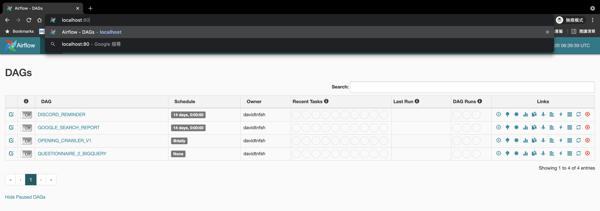
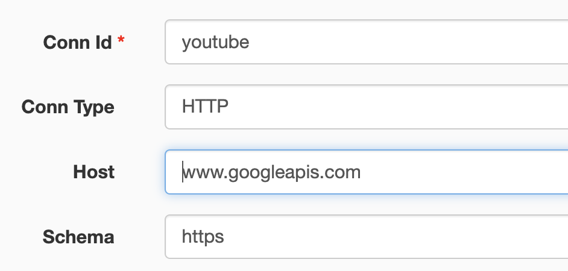

# PyConTW ETL


Using Airflow to implement our ETL pipelines


[TOC]

## Year to Year Jobs

這三個 job 什麼時候打開需要人工確認（麻煩當年的組長大大了），理論上是售票開始前我們要測試一下然後打開

1. `gcloud beta compute ssh --zone asia-east1-b data-team --project pycontw-225217 -- -NL 8080:localhost:8080`
2. Navigate to <http://localhost:8080/admin/>
3. 打開下列的 Airflow tasks:
    1. `KKTIX_DISCORD_BOT_FOR_TEAM_REGISTRATION`: 每天送賣票的銷量資訊到 discord 給註冊組看
    2. `KKTIX_TICKET_ORDERS_V3`: 每五分鐘就去抓最新的 kktix 資料進 BigQuery, 更新後 metabase 相關連的 dashboard 就會更新（售票完之後可以關掉）
    3. `KLAVIYO_SEND_MAIL_V3`: 每年寄發行前信時啓動隨買即用, 已購票的用戶會批次寄發信件, 新的購票者也會批次派發送信

## Dags

* Dag 的命名規則請看這篇 [阿里巴巴大數據實戰](https://medium.com/@davidtnfsh/%E5%A4%A7%E6%95%B0%E6%8D%AE%E4%B9%8B%E8%B7%AF-%E9%98%BF%E9%87%8C%E5%B7%B4%E5%B7%B4%E5%A4%A7%E6%95%B0%E6%8D%AE%E5%AE%9E%E8%B7%B5-%E8%AE%80%E6%9B%B8%E5%BF%83%E5%BE%97-54e795c2b8c)
* Please refer to [this article](https://medium.com/@davidtnfsh/%E5%A4%A7%E6%95%B0%E6%8D%AE%E4%B9%8B%E8%B7%AF-%E9%98%BF%E9%87%8C%E5%B7%B4%E5%B7%B4%E5%A4%A7%E6%95%B0%E6%8D%AE%E5%AE%9E%E8%B7%B5-%E8%AE%80%E6%9B%B8%E5%BF%83%E5%BE%97-54e795c2b8c) for naming guidline
    * examples
        1. `ods/opening_crawler`: Crawlers written by @Rain. Those openings can be used for the recruitment board, which was implemented by @tai271828 and @stacy.
        2. `ods/survey_cake`: A manually triggered uploader that would upload questionnaires to bigquery. The uploader should be invoked after we receive the surveycake questionnaire.

## Prerequisites
1. [Install Python 3.8+](https://www.python.org/downloads/release/python-3811/)
2. [Get Docker](https://docs.docker.com/get-docker/)
3. [Install Git](https://git-scm.com/book/zh-tw/v2/%E9%96%8B%E5%A7%8B-Git-%E5%AE%89%E8%A3%9D%E6%95%99%E5%AD%B8)
4. [Get npm](https://www.npmjs.com/get-npm)

## Install
1. `docker pull docker.io/apache/airflow:1.10.13-python3.8`
2. Python dependencies:
    1. `virtualenv venv`
        * `. venv/bin/activate`
    2. `pip install poetry`
    3. `poetry install`
3. Npm dependencies for linter, formatter, and commit linter (optional):
    1. `brew install npm`
    2. `npm ci`

## Commit
1. `git add <files>`
2. `npm run check`: Apply all the linter and formatter
3. `npm run commit`

## PR
Please use Gitlab Flow, otherwise, you cannot pass docker hub CI

## Run

### Local environment Python Script

1. `. venv/bin/activate`
2. `. ./.env.sh`
3. `cd contrib`
4. Check its command in [contrib/README.md](contrib/README.md)
5. `python xxx.py`

### Local environment Docker

> Find @davidtnfsh if you don't have those secrets.

> **⚠ WARNING: About .env**
> Please don't use the .env for local development, or it might screw up the production tables.

1. Build docker image:
    * Build a production image (for production): `docker build -t davidtnfsh/pycon_etl:prod --cache-from davidtnfsh/pycon_etl:prod -f Dockerfile .`
      If you want to build dev/test image, you also need to build this docker image first because dev/test image is on top of this production image. See below.
    * Build dev/test image (for dev/test): `docker build -t davidtnfsh/pycon_etl:test --cache-from davidtnfsh/pycon_etl:prod -f Dockerfile.test .`
2. Fill in some secrets:
    1. `cp .env.template .env.staging` for dev/test. `cp .env.template .env.production` instead if you are going to start a production instance.
    2. Follow the instructions in `.env.<staging|production>` and fill in your secrets.
       If you are running the staging instance for development as a sandbox and not going to access any specific third-party service, leave the `.env.staging` as-is should be fine.
3. Start the Airflow server:
    * production: `docker run --log-opt max-size=1m -p 8080:8080 --name airflow  -v $(pwd)/dags:/opt/airflow/dags -v $(pwd)/service-account.json:/opt/airflow/service-account.json --env-file=./.env.production davidtnfsh/pycon_etl:prod webserver`
    * dev/test: `docker run -p 8080:8080 --name airflow  -v $(pwd)/dags:/opt/airflow/dags -v $(pwd)/service-account.json:/opt/airflow/service-account.json --env-file=./.env.staging davidtnfsh/pycon_etl:test webserver`
    * Note the difference is just the env file name and the image cache.
4. Portforward compute instance to your local and then navigate to <http://localhost:8080/admin/>:
   1. `gcloud beta compute ssh --zone "asia-east1-b" "data-team" --project "pycontw-225217" -- -NL 8080:localhost:8080`
   2. If Port 8080 is already in use. You need to stop the service occupied 8080 port on your local first.

    
5. Setup Airflow's Variable and Connections:
    * Youtube: 

### Local environment Docker (Windows)
> Do not use Windows Powershell; please use Command Prompt instead.

> Find @davidtnfsh if you don't have those secrets.

> **⚠ WARNING: About .env**
> Please don't use the .env for local development, or it might screw up the production tables.

1. Build docker image:
    * Build a production image (for production): `docker build -t davidtnfsh/pycon_etl:prod --cache-from davidtnfsh/pycon_etl:prod -f Dockerfile .`
      If you want to build dev/test image, you also need to build this docker image first because dev/test image is on top of this production image. See below.
    * Build dev/test image (for dev/test): `docker build -t davidtnfsh/pycon_etl:test --cache-from davidtnfsh/pycon_etl:prod -f Dockerfile.test .`
2. Fill in some secrets:
    1. `copy .env.template .env.staging` for dev/test. `copy .env.template .env.production` instead if you are going to start a production instance.
    2. Follow the instructions in `.env.<staging|production>` and fill in your secrets.
       If you are running the staging instance for development as a sandbox, and not going to access any specific thrid-party service, leave the `.env.staging` as-is should be fine.
3. Start the Airflow server:
    * production: `docker run -p 8080:8080 --name airflow -v "/$(pwd)"/dags:/opt/airflow/dags -v "/$(pwd)"/service-account.json:/opt/airflow/service-account.json --env-file=./.env.production davidtnfsh/pycon_etl:prod webserver`
    * dev/test: `docker run -p 8080:8080 --name airflow  -v "/$(pwd)"/dags:/opt/airflow/dags -v "/$(pwd)"/service-account.json:/opt/airflow/service-account.json --env-file=./.env.staging davidtnfsh/pycon_etl:test webserver`
    * Note the difference are just the env file name and the image cache.
4. Portforward compute instance to your local and then navigate to <http://localhost/admin/>:
   1. `gcloud beta compute ssh --zone "asia-east1-b" "data-team" --project "pycontw-225217" -- -N -L 8080:localhost:8080`
   2. If Port 8080 is already in use. You need to stop the service occupied 8080 port on your local first.


#### BigQuery (Optional)
1. Setup the Authentication of GCP: <https://googleapis.dev/python/google-api-core/latest/auth.html>
    * After invoking `gcloud auth application-default login`, you'll get a credentials.json resides in `$HOME/.config/gcloud/application_default_credentials.json`. Invoke `export GOOGLE_APPLICATION_CREDENTIALS="/path/to/keyfile.json"` if you have it.
    * service-account.json: Please contact @david30907d using email, telegram, or discord. No worry about this json if you are running the sandbox staging instance for development.
2. Give [Toy-Examples](#Toy-Examples) a try

## Deployment & Setting Up Credentials/Env
1. Login to the data team's server:
    1. `gcloud compute ssh --zone "asia-east1-b" "data-team"  --project "pycontw-225217"`
    2. service:
        * ETL: `/home/zhangtaiwei/pycon-etl`
        * btw, metabase is located here: `/mnt/disks/data-team-additional-disk/pycontw-infra-scripts/data_team/metabase_server`
2. Pull the latest codebase to this server: `sudo git pull`
3. Add Credentials (only need to do once):
    * Airflow:
        * Connections:
            * kktix_api: `conn_id=kktix_api`, `host` and `extra(header)` are confidential since its KKTIX's private endpoint. Please DM @GTB or data team's teammembers for these credentials.
                * extra: `{"Authorization": "bearer xxx"}`
            * klaviyo_api: `conn_id=klaviyo_api`, `host` is https://a.klaviyo.com/api
        * Variables:
            * KLAVIYO_KEY: Create from https://www.klaviyo.com/account#api-keys-tab
            * KLAVIYO_LIST_ID: Create from https://www.klaviyo.com/lists
            * KLAVIYO_CAMPAIGN_ID: Create from https://www.klaviyo.com/campaigns
            * kktix_events_endpoint: url path of kktix's `hosting_events`, ask @gtb for details!

### CI/CD
Please check [.github/workflows](.github/workflows) for details

## Tutorials

BigQuery Example:

```python
from google.cloud import bigquery

client = bigquery.Client(project='pycontw-225217')

# Perform a query.
QUERY = '''
    SELECT scenario.day2checkin.attr.diet FROM `pycontw-225217.ods.ods_opass_attendee_timestamp`
'''
query_job = client.query(QUERY)  # API request
rows = query_job.result()  # Waits for query to finish

for row in rows:
    print(row.diet)
```

### Conventions

* table name convention:
    


## DevOps (Will deprecate this if we don't bump into out-of-disk issue any more)

1. Find topk biggest folders: `du -a /var/lib/docker/overlay2 | sort -n -r | head -n 20`
2. Show the folder size: `du -hs xxxx`
3. delete those pretty big folder
4. `df -h`