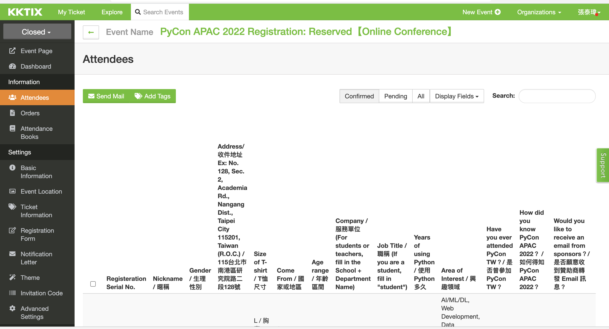

# Contrib

## Upload KKTIX

1. Navigate to KKTIX's attendees page
2. Download the CSV
3. `upload-kktix-ticket-csv-to-bigquery.py -p pycontw-225217 -d ods -t ods_kktix_ticket_<corporate/individual/reserved>_attendees --upload`

## Survey Cake

[Demo Video](https://www.loom.com/share/4c494f1d3ce443c6a43ed514c53b70ff)
1. download CSV from survey cake (account: data-strategy-registration-survey-cake@pycon.tw)
2. `. ./.env.sh `
2. `cd contrib/survey_cake`
3. `python upload-survey-cake-csv-to-bigquery.py --year=<20xx> -c <name of contributor>`
    1. it would upload data to Bigquery's `test` dataset
    2. If everything looks good, you can `copy` the `fact table` and `dimension table` first
    3. Then run `python upload-survey-cake-csv-to-bigquery.py --year=<20xx> -p`. `-p` stands for `production`

## KKTIX BigQuery Transform
1. Background: Start from 2022, we extract the KKTIX data via KKTIX API and load to "pycontw-225217.ods.ods_kktix_attendeeId_datetime". However most of the data are store in the ATTENDEE_INFO column with json format. To use metabase with SQL, users need to extract the data by json_extract with the knowledge kktix format instead of flat database. And we also need to rewrite all the SQLs build for current databases.
2. Solution: Transform the tables in backend that we could keep the same user experience by using Metabase.
3. Run: 
 - for 3 tables in single bash script: `./kktix_bq_etl.sh 2023`
