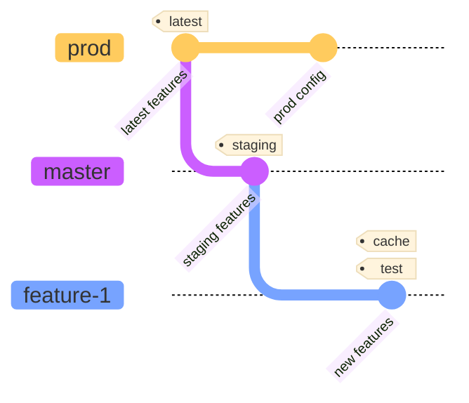

# Contributing Guide

## How to Contribute to this Project

### 1. Clone this repository:

```bash
git clone https://github.com/pycontw/pycon-etl
```

### 2. Create a new branch:

Please checkout your branch from the latest master branch before doing any code change.

```bash
# Checkout to the master branch
git checkout master

# Ensure that's you're on the latest master branch
git pull origin master

# Create a new branch
git checkout -b <branch-name>
```

### 3. Make your changes.

If your task uses an external service, add the connection and variable in the Airflow UI.

### 4. Test your changes in your local environment:

- Ensure that the dag files are loaded successfully.
- Verify that the tasks run without errors.
- Confirm that your code is properly formatted and linted. See [Convention](#convention) section for more details.
- Check that all necessary dependencies are included in the `pyproject.toml` file.
  - Airflow dependencies are managed by [uv].
- Ensure that all required documentation is provided.

### 5. Push your branch:

```bash
git push origin <branch-name>
```

### 6. Create a Pull Request (PR).

If additional steps are required after merging and deploying (e.g., add new connections or variables), please list them in the PR description.

### 7. Wait for the review and merge.

## Convention

### Airflow Dags
- Please refer to [「大數據之路：阿里巴巴大數據實戰」 讀書心得](https://medium.com/@davidtnfsh/%E5%A4%A7%E6%95%B0%E6%8D%AE%E4%B9%8B%E8%B7%AF-%E9%98%BF%E9%87%8C%E5%B7%B4%E5%B7%B4%E5%A4%A7%E6%95%B0%E6%8D%AE%E5%AE%9E%E8%B7%B5-%E8%AE%80%E6%9B%B8%E5%BF%83%E5%BE%97-54e795c2b8c) for naming guidelines.
- Table name convention:
  

### Code Formatting
Please run `make format` to ensure your code is properly formatted before committing; otherwise, the CI will fail.

### Commit Message
It is recommended to use [Commitizen](https://commitizen-tools.github.io/commitizen/).

## Release Management (CI/CD)
We use [Python CI] and [Docker Image CI] to ensure our code quality meets specific standards and that Docker images can be published automatically.

When a pull request is created, [Python CI] checks whether the code quality is satisfactory. At the same time, we build a `cache` image using `Dockerfile` and a `test` image with `Dockerfile.test`, which are then pushed to the [GCP Artifact Registry].

After a pull request is merged into the `master` branch, the two image tags mentioned above are created, along with a new `staging` tag for the image generated from `Dockerfile`.

Once we verify that the `staging` image functions correctly, we merge the `master` branch into the `prod` branch through the following commands.

<!--TODO: This is not ideal. The "master" and "prod" branches should be protected and should not allow human pushes. We should create a GitHub action for this..-->

```bash
git checkout prod
git pull origin prod

git merge origin/master

git push origin prod
```

This triggers the [Docker Image CI] again to update the `cache`, `test`, and `staging` images, as well as to create a `latest` image that we will later use for deploying to our production instance. See the [Deployment Guide](./DEPLOYMENT.md) for the following steps.



[uv]: https://docs.astral.sh/uv/
[Python CI]: https://github.com/pycontw/pycon-etl/actions/workflows/python.yml
[Docker Image CI]: https://github.com/pycontw/pycon-etl/actions/workflows/dockerimage.yml
[GCP Artifact Registry]: https://cloud.google.com/artifact-registry/
